# Improving women's opportunities in society

*STAT 325 Final Project — Ellie Lagrave*

## Elevator Pitch:

The typically discussed criteria for the success of a country is gross domestic product (GDP). The core issue is that GDP only represents a country's economic prosperity due to the production of goods and services. This measurement does not reflect the health nor wealth of individuals in that country. We need a better understanding of how prosperous citizens are in distinct categories, such as education and workforce potential, so that the most effective improvements can be made to enrich people's lives. People and their capabilities should be the measure of a country's progress and not economic factors alone. The Human development index (HDI), by the United Nations Development Program (UNDP), seeks to quantify these measurements by analyzing life expectancy, educational opportunities, and individual income.

## Introduction:

Furthermore, as stated on the UNDP website, HDI simplifies a lot of attributes that make up human development and "does not reflect on inequalities, poverty, human security, empowerment, etc." Gender equality is an incredibly important metric to measure human success, 49.6% of the global population are women and their success and prosperity in life is integral to improving human development outcomes. "A fuller picture of a country's level of human development requires analysis of other indicators and information presented in the HDR statistical annex [such as the Gender Equality Index (GII)]." The primary focus of this analysis is to examine in which ways to enhance gender equality to positively affect human development.

## Literature Review:

Other statistic studies, such as Female Education and Childbearing(Pradhan), has found that increasing female secondary education opportunities will reduce total fertility rate and reduce adolescent birth rates. The Effect of Female Education on Fertility and Infant Health(McCrary, Royer) states that "education is widely held to be a key determinant of fertility and infant health." Female education and its Impact on Fertility(Kim) found a negative correlation between years of secondary education and total fertility rate. They also found "the fertility gap between women with primary vs no education widens as incomes increase but decreases at higher (secondary vs primary) education levels." Further, "approximately one-third of a million women die each year from pregnancy-related conditions" (Karleson et al.)

## Model:

Human development index (HDI) is "is the geometric mean of normalized indices for each of the three dimensions:" life expectancy at birth, gross national income per capita, and mean/expected years of schooling. HDI values will be used as a proxy for human development and quality of life in each country, thus HDI is the primary dependent variable. Gender inequality index (GII) represents the intensity of gender disparities and is a composite metric of reproductive health, empowerment, and labor market equality.  GII data is based on maternal mortality, adolescent birth rates, secondary education gender gap, parliamentary seat gender gap, and labor force participation rates. GII value properties will be looked at individually and as a group to see how improvements in gender equality can boost human development and quality of life.

## Data Analysis:

Both GII and HDI datasets represent data collected from 170 countries around the globe for the year 2021, datasets were combined based on country. Also, 21 countries had to be removed during data cleaning processes, due to blank or NA data points for key variables.  Relationships between variables are expressed with each point of comparison representing a difference between variables in a specific country. However, specific countries are not important in the context of this study because this study seeks to examine the ways that improving gender equality can create a better quality of life for any country.

For these tests, we will be conducting a multiple linear regression analysis of 5 independent predictors and how they relate to the dependent variable HDI value. The null hypothesis H0 is that all the coefficients are equal to 0. The alternative hypothesis, HA, is that at least one of the coefficients is not equal to zero, meaning our independent variables have some relationship with the dependent variable. Scatter plots were used to analyze linearity and model assumptions. Finally test statistics such as P values, R2, and residual standard error will be employed to verify the model accuracy and either reject or fail to reject the null hypothesis.

## Simple Linear Regression:

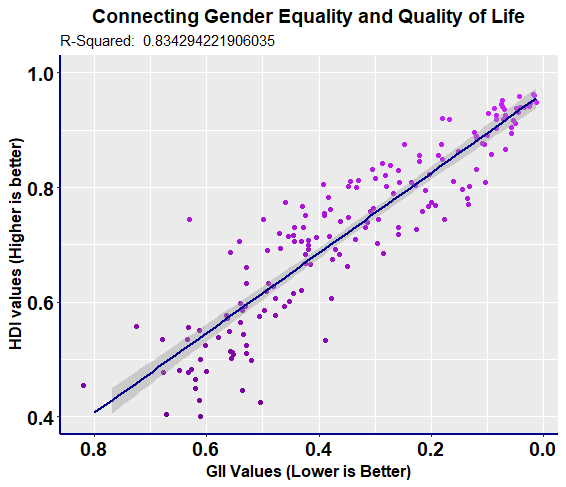

*Figure 01: This graph represents the positive relationship between reducing*

*gender equality (GII values) and increasing quality of life (HDI values)*

First, simple linear regression was performed to check for an overall linear relationship between the two datasets. HDI and GII have a very large negative correlation and an R2 value of 83% indicating a large part of the increases in human development index can be explained by improvements in gender equality (lowering of the index value). Strong correlation between the index values is a good indicator for further tests of their components. A simple linear regression test was conducted to compare GII and HDI values, this was plotted in Figure 01 with 95% confidence interval included. As predicted with the scatter plot, the Y-intercept is 0.2581 and the slope of the line is 0.7084 indicating a strong relationship between gender equality and human development.

## Data Trimming:

The dataset included several NA and empty data points that had to be trimmed. There was also header and footer data that had to be removed and variable naming that was updated. Due to data cleaning processes, 21 countries were removed from the dataset. This reduced the number of countries from 194 to 170 countries, this reduction in data points should not negatively affect the model. Outlier testing, below, indicated no need to trim outlier data points. After data cleaning, linear regression assumptions were verified, and the model was studied.

## Model Assumptions:

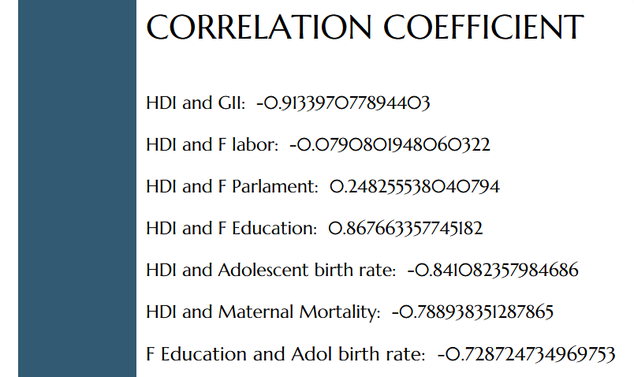

*Figure 02: This chart shows the correlation coefficients*

*between variables in our data set*

To establish linearity between variables, the correlation coefficient and R2 values were then examined between each of GII's component values and the human development index values, Figure 02. One of the assumptions of the linear model being used is a linear relationship between dependent and independent variables. A very low correlation coefficient will indicate a non-linear relationship, this can also be verified on a scatter plot, as seen in Table 01. Because of this requirement, labor force participation and parliamentary gender equality will not be candidates for predictors in the multiple linear regression model.

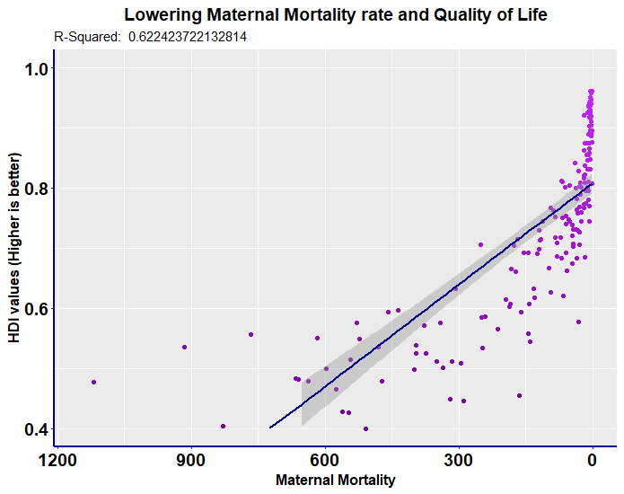

*Figure 03: Maternal Mortality and adolescent birth rate scatterplots*

Adolescent birth rate and maternal mortality (Figure 03) may fit better to a non-linear relationship using a log transformation, but the relationship is close enough to linearity that it can be studied in that way (-0.84 and -0.78 correlation coefficient respectively).  All the five predictors that were selected have a strong enough linear relationship to be candidates. The data for each predictor was plotted against HDI values and simple linear regression was conducted to verify linearity, this can be seen on the figures in Table 01.

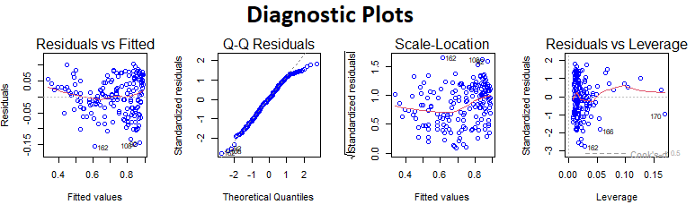

*Figure 04: This chart shows the diagnostic plots of the multiple linear regression model.*

The data was then checked using Regression Diagnostics plots, pictured above in Figure 04. The residuals vs fitted values graph indicates more residual error on the extremities of the model. Looking at the scatter plots in Table 01, this can be observed by looking at the larger residuals on the left and right sides of the plots. The residuals vs fitted plot is still largely horizontal, with only a 0.04 deviation, which indicates a linear relationship for the multiple linear regression model.

A Q-Q residuals plot was used to determine if the residuals are normally distributed for the data set. The probability plot of the residuals mostly follows the dashed reference line, indicating the dataset follows a normal distribution.  A Scale-Location plot was then used to check the homogeneity of the variance of the residuals (homoscedasticity). The reference line is mostly horizontal with the points equally spaced out, which indicates the residuals are equally spaced along the range of predictors and there is not a problem with homoscedasticity in this model.  Note, there is more variance in residuals near the upper ends of the model, this is likely due to maternal mortality, as seen in Table 01.

The data was also checked for outliers by producing box plots, but seeing as the dependent variable is an index value that's been normalized and standardized to be between 0 and 1 there are likely not any outliers. Further, a Residuals vs. Leverage plot was examined to check for outliers and high leverage points. The three most extreme points are labeled on the graph (measurements 162, 166, and 170), all three points are within Cook's distance reference line. No outliers exceed 3 standard deviations, and no values are in the bottom or top right corners which indicates no influential values that will negatively affect the linear regression model. The Residuals vs. Leverage plot, leverage statistic (0.07), and the Cook's Distance plot  (Table 01 Figure T7) shows that no values are considered outliers.

## Model Analysis:

*Figure 05: Multiple linear regression model equation.*

With this analysis, the range of HDI values is an index between 0 and 1, therefore the coefficients magnitude is rather small. The size of the coefficients has no bearing on the accuracy of this model.  The larger y-intercept value makes sense when examining the scatter plots in Table 01, all the countries have an HDI value range greater than 0.4, meaning the regression line starts higher up the graph. Increases in adolescent birth rate and maternal mortality both decrease human development outcomes. Whereas increases in female secondary education will have the greatest increase in HDI values.

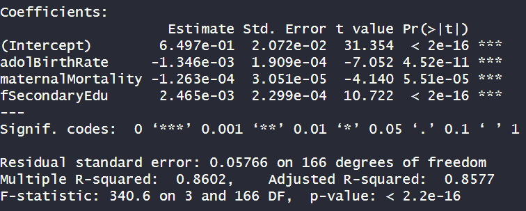

*Figure 06: Multiple linear regression model summary.*

An adjusted R2 value of 0.8577 indicates that our model accurately predicts 85.7% of the change in HDI values between countries when considering the number of predictor variables. This model is better than the simple linear regression model directly comparing HDI values to GII values, which had an adjusted R2 value of 83.3%. That was the only other mode that came close to representing the relationship between gender equality and human development. All other models looking at individual predictor's relationships to HDI in a simple linear model had an R2 value of less than 75%, as can be seen in Table 01.

Residual Standard Error (RSE), or sigma, is a measure of the error of the model's prediction, a lower value represents a more accurate model. The RSE test statistic was calculated to be 0.07981, meaning only a 7.98% error rate when predicting values with this model. This was lower than the simple linear regression model comparing HDI and GII directly, which had an error rate of 8.64%.

By examining Figure 06, the P-values for each individual predictor and for the entire model are all less than the significance level of 0.05. Thus, all predictors are statistically significant when studying this relationship. All these factors combined indicate that the multiple linear regression model is an accurate representation of the relationship between gender equality and human development. Further, based on this information we reject the null hypothesis. The alternative hypothesis is accepted that at least one of the independent variables is a predictor for HDI value.

*Figure 07: Education's effect on adolescent births.*

## Conclusion:

Increases in female secondary education have been found to reduce the adolescent birth rate, this linear relationship can be seen in Figure 07. This could negatively impact the model, but it also indicates a method to get the most positive outcome in real world scenarios. The greatest increases in predicted HDI values from the equation for model are achieved by targeted funding for female secondary education. This can be enhanced by providing access to contraceptives and working to reduce the adolescent birth rate. Investment in medical systems and prenatal care could also decrease maternal mortality to further improve HDI values.

Overall, the most funding possible should be directed toward increasing rates of female secondary education in countries with low HDI values. Further, adolescent pregnancies are associated with higher risks of premature birth, low birth weight, and higher risk of infant and maternal mortality (Saxbe et al.). Adolescence is the most dangerous time to give birth, therefore reductions in adolescent birth rate due to increased access to contraceptives and secondary education will have the most positive affect for the empowerment and equality of women. Globally, women are only empowered to achieve on average 60 percent of their full potential. Addressing gender equality is an incredibly important thing to address. No one should be denied their potential based on gender discrimination. As shown with this model, global investment in secondary education opportunities for women is one of the most important steps to take in order to address gender inequality.

## Table 01:

Composite figures from the written report (T1–T7).

| Figure T1 | Figure T2 |
| :---: | :---: |
|  | 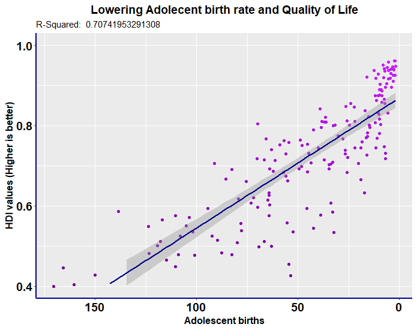 |

| Figure T3 | Figure T4 |
| :---: | :---: |
| 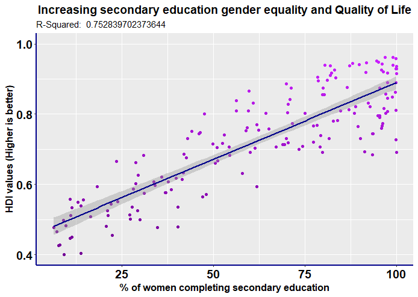 | 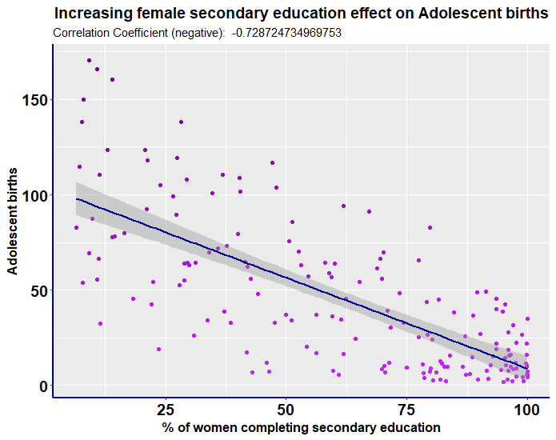 |

| Figure T5 | Figure T6 |
| :---: | :---: |
| 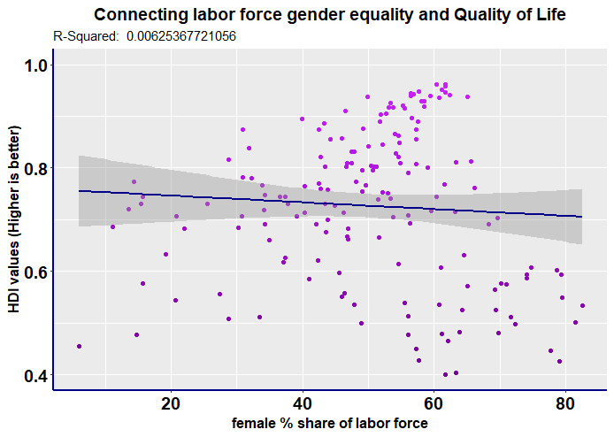 | 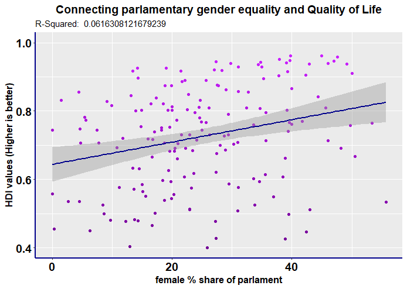 |

### Figure T7

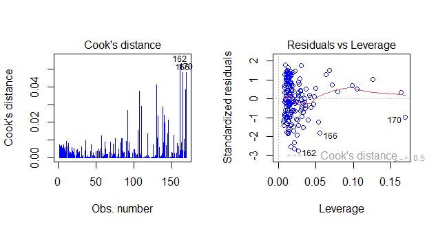

## Sources:

Pradhan, E. (n.d.). Female education and childbearing: A closer look at the data. World Bank Blogs. https://blogs.worldbank.org/health/female-education-and-childbearing-closer-look-data

McCrary, J., & Royer, H. (2011, February 1). The effect of female education on fertility and infant health: Evidence from school entry policies using exact date of birth. The American economic review. https://www.ncbi.nlm.nih.gov/pmc/articles/PMC3073853/

Saxbe, S. (n.d.). Risks of teen pregnancy. Nationwide Children's Hospital. https://www.nationwidechildrens.org/family-resources%20education/700childrens/2016/10/risks-of-teen-pregnancy

Karlsen, S., Say, L., Souza, J.-P., Hogue, C. J., Calles, D. L., Gulmezoglu, A. M., & Raine, R. (2011, July 29). The relationship between maternal education and mortality among women giving birth in health care institutions: Analysis of the cross sectional who global survey on maternal and perinatal health - BMC public health. BioMed Central. https://bmcpublichealth.biomedcentral.com/articles/10.1186/1471-2458-11-606
